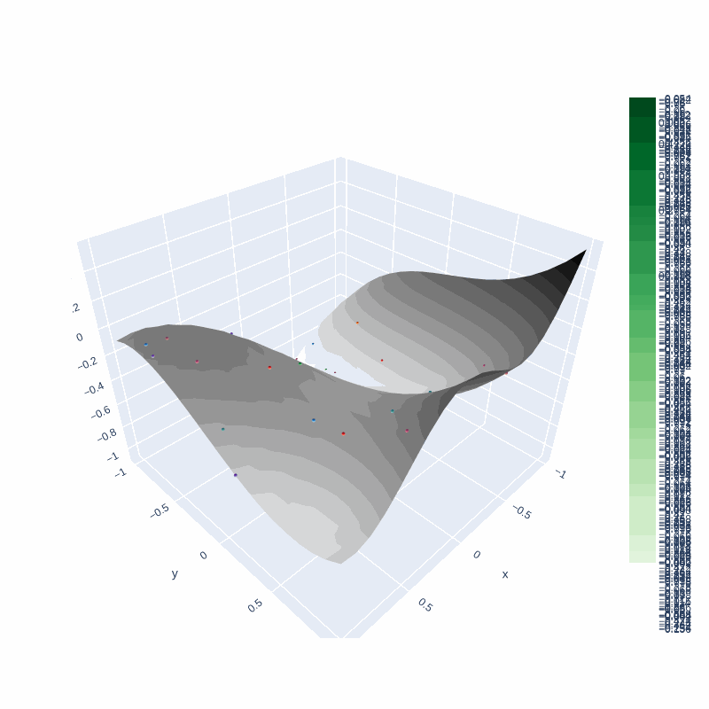

# Diffusion Visualizations
Basic visualizations for the forward and reverse process in diffusion models

# Requirements
Install using `pip install -r requirements.txt`

# Forward Process
Run `forward.py`  
TODO: legends are mis-plotted

	

## Sampling 
Added soon 